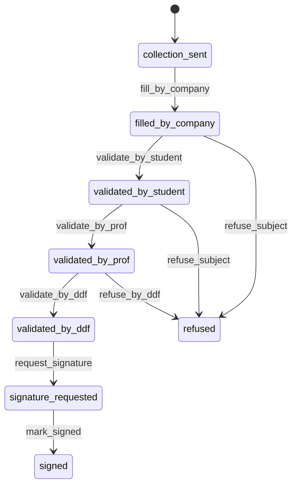
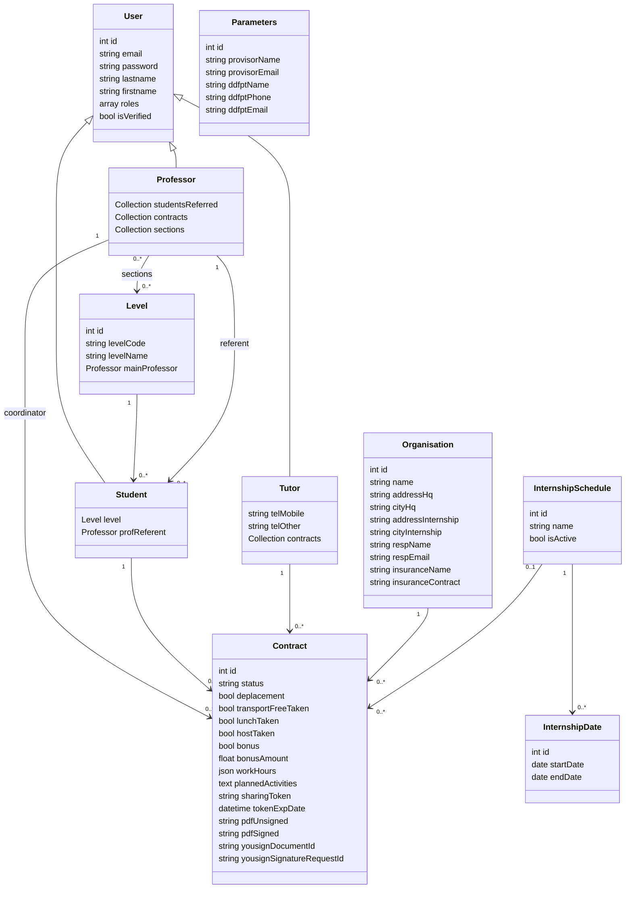

# Documentation complete du projet Conventio

## 1. Contexte du projet

Conventio est une application web Symfony de gestion des conventions de stage. Le projet a ete realise dans un contexte de BTS SIO option SLAM, avec un objectif concret : remplacer un parcours manuel, souvent gere par echanges d'emails et documents Word, par un outil centralise capable de collecter les informations, valider les conventions, generer le document final et lancer une signature electronique.

Le portfolio public presente Conventio comme une application Symfony de gestion, validation, generation PDF et signature electronique des conventions de stage. Le projet s'inscrit donc dans une logique d'application metier : plusieurs acteurs interviennent sur un meme dossier, chacun avec ses droits, ses formulaires et ses validations.

Sources utilisees pour cette documentation :

- analyse du code du depot local ;
- lecture du portfolio public : `https://portfolio.kanely.fr/` ;
- structure Symfony, entites Doctrine, controleurs, services, templates, workflow et tests presents dans le projet.

## 2. Probleme initial

La gestion classique d'une convention de stage pose plusieurs difficultes :

- les informations sont saisies plusieurs fois par l'etudiant, l'entreprise et l'administration ;
- les donnees peuvent etre incompletes ou incoherentes ;
- le suivi du statut est difficile quand plusieurs personnes doivent valider ;
- le document final doit respecter un modele officiel ;
- la signature manuelle ralentit fortement le processus ;
- l'administration doit savoir quelles conventions sont en attente, validees, signees ou refusees.

Conventio apporte une reponse applicative a ces contraintes en transformant le processus en workflow controle.

## 3. Objectifs

- Permettre a un etudiant de lancer une demande de convention.
- Envoyer un lien securise a l'entreprise pour completer les informations.
- Faire relire et valider la convention par l'etudiant.
- Faire valider pedagogiquement la convention par un professeur referent.
- Faire valider administrativement la convention par la DDF.
- Generer un PDF conforme au modele de convention.
- Envoyer le document en signature electronique via YouSign.
- Suivre l'etat de signature et recuperer le PDF signe.
- Centraliser les tableaux de bord et les actions selon les roles.

## 4. Stack technique

| Element | Technologie |
| --- | --- |
| Backend | PHP 8.2+, Symfony 7.4 |
| ORM | Doctrine ORM 3 |
| Base de donnees | PostgreSQL par defaut, SQLite possible en local/test |
| Templates | Twig |
| Formulaires | Symfony Form |
| Securite | Symfony Security, roles, CSRF, hash de mot de passe |
| Emails | Symfony Mailer, templates Twig, configuration Brevo possible |
| PDF | Gotenberg avec conversion LibreOffice/DOCX et fallback HTML |
| Signature electronique | YouSign API sandbox v3 |
| Workflow | Symfony Workflow en state machine |
| Tests | PHPUnit, Symfony BrowserKit |

## 5. Architecture generale

Le projet suit l'organisation classique d'une application Symfony :

- `src/Entity` : modele metier Doctrine.
- `src/Controller` : routes HTTP et orchestration des cas d'utilisation.
- `src/Form` : formulaires Symfony pour les saisies utilisateur.
- `src/Repository` : requetes specifiques Doctrine.
- `src/Service` : logique transverse, generation PDF, signature, notifications.
- `templates` : vues Twig HTML, emails et PDF.
- `config/packages/workflow.yaml` : definition du cycle de vie d'une convention.
- `migrations` : evolution du schema de base de donnees.
- `tests` : tests fonctionnels.

## 6. Acteurs

### Etudiant

L'etudiant cree une demande de convention, renseigne l'entreprise et le tuteur, consulte son tableau de bord, relit les informations completees par l'entreprise et valide la convention avant transmission au professeur.

### Entreprise / tuteur

Le tuteur recoit un lien de collecte. Il complete les donnees de l'organisme, les informations de contact, les horaires, les avantages et les activites prevues.

### Professeur referent

Le professeur controle la coherence pedagogique du stage. Il peut valider ou refuser la convention avec un motif.

### DDF / administration

La DDF pilote les campagnes de stage, valide administrativement les conventions, genere les PDF, lance les signatures et suit les conventions signees.

### Proviseur

Le proviseur intervient dans la phase finale de signature. Ses informations sont stockees dans les parametres de l'application.

## 7. Fonctionnalites principales

### Authentification et comptes

- Connexion via `/login`.
- Deconnexion via `/logout`.
- Inscription etudiant via `/register/student`.
- Inscription professeur via `/register/professor`.
- Verification email via SymfonyCasts VerifyEmail.
- Reinitialisation de mot de passe via SymfonyCasts ResetPassword.
- Hash automatique des mots de passe.
- Roles applicatifs : `ROLE_STUDENT`, `ROLE_PROFESSOR`, `ROLE_TUTOR`, `ROLE_ADMIN`.

### Gestion des niveaux

- Creation, modification et suppression des classes/niveaux.
- Association des etudiants a un niveau.
- Association de professeurs a des sections.
- Definition d'un professeur principal pour affecter automatiquement un referent.

### Gestion des campagnes de stage

- Creation d'une campagne de stage par niveau.
- Ajout d'une ou plusieurs periodes de stage.
- Activation/desactivation logique via `isActive`.
- Synchronisation des conventions ouvertes quand les dates changent.

### Creation de convention

L'etudiant lance une demande depuis `/etudiant/convention/nouveau`.

Le systeme :

- recupere l'etudiant connecte ;
- verifie qu'il possede une classe ;
- recherche une campagne active pour cette classe ;
- cree ou reutilise un compte tuteur selon l'email saisi ;
- cree une organisation partiellement renseignee ;
- genere un token de partage ;
- assigne un professeur referent ;
- envoie un email a l'entreprise.

### Collecte entreprise

L'entreprise accede au formulaire via `/company/fill/{token}`.

Le formulaire permet de completer :

- identite de l'organisme ;
- adresse du siege ;
- lieu du stage ;
- responsable ;
- tuteur ;
- assurances ;
- horaires hebdomadaires ;
- avantages ;
- activites prevues.

Quand l'entreprise valide, le workflow passe de `collection_sent` a `filled_by_company` et un email est envoye a l'etudiant.

### Validation etudiant

L'etudiant consulte la convention puis valide les informations. Le workflow passe de `filled_by_company` a `validated_by_student`. Le professeur referent recoit ensuite une demande de validation.

### Validation professeur

Le professeur accede a son tableau de bord et aux conventions a valider. Il peut :

- consulter les informations ;
- ouvrir le PDF si disponible ;
- valider pedagogiquement ;
- refuser avec un motif.

En cas de validation, la convention passe a `validated_by_prof`. En cas de refus, elle passe a `refused`.

### Validation DDF

La DDF visualise les conventions classees par statut :

- a valider ;
- validees par la DDF ;
- en signature ;
- signees.

Elle peut previsualiser le PDF, valider, refuser, generer le PDF, lancer la signature, relancer les notifications et synchroniser le document signe.

### Generation PDF

Le service `ContractPdfService` genere le PDF final :

- en priorite depuis `Conventions de stage-template-fr.docx` ;
- avec remplacement des placeholders dans le XML interne du DOCX ;
- avec remplissage automatique du tableau des horaires ;
- avec normalisation des ancres de signature ;
- via Gotenberg LibreOffice ;
- avec fallback HTML/Twig si le modele DOCX n'existe pas.

Les PDF non signes sont stockes dans `var/contracts/unsigned`.
Les PDF signes sont stockes dans `var/contracts/signed`.

### Signature electronique

Le service `YouSignService` :

- cree une demande de signature ;
- upload le PDF ;
- ajoute les signataires dans l'ordre ;
- active la demande ;
- consulte les statuts ;
- telecharge le document signe ;
- gere les relances manuelles ;
- verifie la signature HMAC des webhooks.

Les signataires attendus sont :

1. l'etudiant ;
2. l'organisme / tuteur ;
3. le proviseur.

### Webhook YouSign

La route `/webhooks/yousign` recoit les evenements YouSign. Seul l'evenement `signature_request.done` est traite. Le controleur verifie la signature du webhook, retrouve la convention avec l'identifiant YouSign, telecharge le document signe et marque la convention comme signee.

### Commande de synchronisation

La commande `app:contracts:sync-signed` permet de synchroniser manuellement les conventions en attente de signature. Elle est utile si le webhook n'est pas disponible en local ou si l'on veut forcer une verification.

## 8. Workflow metier



## 9. Diagramme de classes



## 10. Modele de donnees

### `User`

Classe parente des utilisateurs. Doctrine utilise un heritage `SINGLE_TABLE` avec une colonne discriminante `discr`. Les etudiants, professeurs et tuteurs partagent donc la meme table utilisateur.

### `Student`

Un etudiant possede un niveau et un professeur referent. Il peut avoir plusieurs conventions.

### `Professor`

Un professeur peut etre referent de plusieurs etudiants, coordonner plusieurs conventions et etre associe a plusieurs sections.

### `Tutor`

Un tuteur herite de `User` et ajoute des numeros de telephone. Il est rattache aux conventions de son entreprise.

### `Organisation`

Contient les informations de l'entreprise ou structure d'accueil : siege, lieu de stage, responsable, assurance et contact.

### `Contract`

Entite centrale du projet. Elle porte :

- le statut du workflow ;
- les relations vers l'etudiant, le tuteur, l'entreprise et le professeur ;
- les horaires au format JSON ;
- les informations de generation PDF ;
- les identifiants YouSign ;
- les motifs de refus professeur/DDF.

### `InternshipSchedule` et `InternshipDate`

Une campagne de stage est rattachee a un niveau et contient une ou plusieurs periodes. Les conventions se rattachent ensuite a une campagne pour calculer les dates de debut et fin.

### `Parameters`

Stocke les informations institutionnelles utiles a la signature finale : proviseur et DDFPT.

## 11. Parcours utilisateur complet

1. L'administration cree les niveaux, professeurs et campagnes de stage.
2. L'etudiant cree son compte et confirme son email.
3. L'etudiant lance une demande de convention.
4. L'entreprise recoit un lien de collecte.
5. L'entreprise complete les informations.
6. L'etudiant relit et valide.
7. Le professeur valide ou refuse.
8. La DDF valide ou refuse.
9. La DDF genere le PDF.
10. La DDF envoie la convention en signature YouSign.
11. Les signataires signent dans l'ordre.
12. Le webhook ou la commande recupere le PDF signe.
13. La convention passe au statut `signed`.

## 12. Securite

Mesures deja presentes :

- hash des mots de passe avec Symfony ;
- authentification par formulaire ;
- roles Symfony ;
- controle d'acces sur les espaces etudiant, professeur et DDF ;
- verification CSRF sur les actions sensibles ;
- verification email a l'inscription ;
- token aleatoire pour le lien entreprise ;
- verification que l'etudiant consulte uniquement ses conventions ;
- verification que le professeur consulte uniquement ses conventions ;
- signature HMAC des webhooks YouSign ;
- requetes Doctrine parametrees.

Points d'attention :

- `tokenExpDate` existe dans l'entite `Contract`, mais la route entreprise ne bloque pas encore explicitement les tokens expires.
- Quelques routes CRUD historiques comme certains index et creation manuelle restent a proteger plus strictement si l'application passe en production.
- Les secrets ne doivent jamais etre stockes dans un fichier versionne ; il faut utiliser `.env.local`, les variables serveur ou Symfony Secrets.
- La configuration YouSign actuelle utilise l'API sandbox.

## 13. Routes importantes

| Route | Role | Usage |
| --- | --- | --- |
| `/` | Public | Accueil |
| `/login` | Public | Connexion |
| `/register/student` | Public | Creation compte etudiant |
| `/register/professor` | Public | Creation compte professeur |
| `/etudiant/convention/nouveau` | Etudiant | Demande de convention |
| `/company/fill/{token}` | Entreprise | Collecte via lien securise |
| `/convention/{id}` | Etudiant | Consultation convention |
| `/convention/{id}/valider` | Etudiant | Validation etudiant |
| `/professor/{id}` | Professeur | Dashboard professeur |
| `/professor/contract/{id}/validate` | Professeur | Validation pedagogique |
| `/admin/ddf/contracts` | Admin | Dashboard DDF |
| `/admin/ddf/contracts/{id}/generate-and-send` | Admin | PDF + signature |
| `/admin/ddf/campaigns` | Admin | Gestion campagnes |
| `/webhooks/yousign` | YouSign | Synchronisation automatique |

## 14. Services applicatifs

### `ContractPdfService`

Responsable de la production du PDF. Il centralise les contraintes documentaires : modele DOCX, placeholders, tableau des horaires, ancres de signature et conversion Gotenberg.

### `ContractSignatureService`

Service d'orchestration. Il valide cote DDF, genere le PDF, lance YouSign, applique les transitions du workflow, relance les notifications et synchronise le document signe.

### `YouSignService`

Service d'integration externe. Il encapsule les appels HTTP a YouSign, la creation de demande, l'ajout des signataires, le suivi des statuts, le telechargement et la verification des webhooks.

### `ProvisorNotificationService`

Envoie au proviseur une notification quand la convention est prete a signer.

## 15. Installation locale

Prérequis :

- PHP 8.2 ou superieur ;
- Composer ;
- une base PostgreSQL ou SQLite ;
- Gotenberg si l'on veut generer les PDF ;
- une cle YouSign sandbox si l'on veut tester la signature electronique.

Commandes typiques :

```bash
composer install
php bin/console doctrine:database:create
php bin/console doctrine:migrations:migrate
php bin/console doctrine:fixtures:load
php -S 127.0.0.1:8000 -t public
```

Variables importantes :

```dotenv
APP_ENV=dev
APP_SECRET=...
DATABASE_URL=...
MAILER_DSN=...
GOTENBERG_URL=http://localhost:3000
YOUSIGN_API_KEY=...
YOUSIGN_WEBHOOK_SECRET=...
```

## 16. Tests

Le projet contient des tests fonctionnels sur l'inscription professeur :

- creation d'un compte professeur ;
- redirection apres inscription ;
- verification du role ;
- rejet d'une adresse email non academique.

Commande :

```bash
php bin/phpunit
```

## 17. Problemes rencontres et solutions apportees

| Probleme | Cause | Solution |
| --- | --- | --- |
| Suivre un processus avec plusieurs validateurs | Une convention change d'etat selon l'acteur | Mise en place d'un state machine Symfony Workflow |
| Eviter les conventions modifiees au mauvais moment | Une convention ne doit pas etre modifiable apres certaines validations | Controle des statuts avant edition et transitions controlees |
| Assigner automatiquement le bon professeur | L'etudiant peut ne pas avoir de referent direct | Recherche du professeur referent, puis du professeur principal du niveau |
| Collecter les donnees entreprise sans compte complet | L'entreprise doit acceder rapidement au formulaire | Token aleatoire de partage envoye par email |
| Produire un document conforme | Le modele officiel est un DOCX | Remplacement des placeholders dans `word/document.xml` puis conversion avec Gotenberg |
| Les placeholders DOCX peuvent etre coupes par Word | Word separe parfois un placeholder en plusieurs balises XML | Regex dediee pour detecter les placeholders fragmentes |
| Remplir proprement les horaires | Les horaires sont structurés par jour et demi-journee | Stockage JSON normalise dans `Contract::workHours` |
| Integrer la signature electronique | YouSign impose une API avec document, signataires et activation | Encapsulation dans `YouSignService` et orchestration dans `ContractSignatureService` |
| Recuperer le PDF signe | Le webhook peut ne pas etre disponible en local | Webhook securise + commande CLI de synchronisation manuelle |
| Gérer les erreurs externes | Gotenberg ou YouSign peuvent etre indisponibles | Exceptions explicites et messages utilisateur dans le dashboard DDF |
| Empêcher les validations non autorisees | Chaque acteur ne doit agir que sur ses conventions | Verifications d'identite dans les controleurs et CSRF sur les POST |

## 18. Limites actuelles

- Le controle d'expiration du token entreprise peut etre renforce.
- Les routes CRUD historiques doivent etre auditees avant production.
- La signature electronique est configuree pour le sandbox YouSign.
- Le projet depend de Gotenberg pour la generation fiable des PDF.
- Il manque des tests fonctionnels sur le parcours complet convention -> signature.
- Les fixtures contiennent des comptes de demonstration qui doivent etre adaptes hors environnement local.

## 19. Ameliorations possibles

- Ajouter une page d'administration des parametres `Parameters`.
- Ajouter un historique des transitions de workflow visible dans l'interface.
- Ajouter des notifications plus detaillees en cas de refus.
- Ajouter des tests de bout en bout pour le parcours etudiant/entreprise/professeur/DDF.
- Ajouter une expiration reelle du lien entreprise.
- Ajouter un systeme d'archivage par annee scolaire.
- Ajouter un export CSV des conventions pour l'administration.
- Ajouter une recherche et des filtres sur les dashboards.
- Ajouter un mode brouillon pour l'entreprise avant soumission.

## 20. Competences BTS SIO mobilisees

- Analyse d'un besoin metier.
- Conception d'une solution applicative.
- Modelisation de donnees relationnelles.
- Developpement backend avec Symfony.
- Gestion des formulaires et validations.
- Gestion des droits et de la securite.
- Integration d'API externe.
- Generation documentaire.
- Tests fonctionnels.
- Documentation technique et utilisateur.
- Maintenance corrective et evolutive.

## 21. Synthese

Conventio est une application metier complete centree sur le cycle de vie d'une convention de stage. Le coeur du projet repose sur une entite `Contract`, un workflow de validation strict, des tableaux de bord par role, une generation PDF automatisee et une integration YouSign pour la signature electronique.

Le projet montre une progression importante : il ne se limite pas a du CRUD, mais traite un processus reel avec des dependances externes, des contraintes documentaires, des droits d'acces, des notifications et un suivi d'etat complet.
